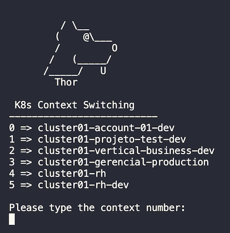

# Easy context switching ( K8s )

When you use kubectl to interact with more than one cluster, you have to type some commands to switch between the different contexts. This is a very simple solution to help you on that.

## How it works

This automation code will read the ~/.kube/config and will give the possibility to choose the context you want to switch on. It is important to use alias to define a friendly name on each context.

## Build & Installation

`go build -o thor cmd/main.go`

After you build you can move the output file called thor to a bin directory that is on your path or use the commando ./thor to execute on the same directoty.